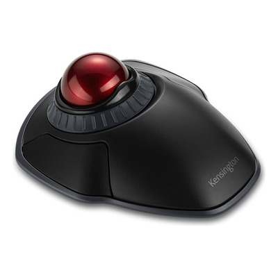

# Passo a Passo da Oficina de Acessibilidade Web - Identificando e Corrigindo Problemas de Acessibilidade

## 1. Introdução e Contexto

- **Apresentação dos princípios WCAG (POUR)**: Perceptível, Operável, Compreensível e Robusto
- **Histórias reais de usuários**: Como Marcos (cego), Ana (baixa visão), Ricardo (mobilidade reduzida) e Camila (dislexia) enfrentam barreiras digitais

## 2. Imagens Acessíveis

- **Exemplo**: Adicionar texto alternativo descritivo

```html
<!-- Antes (inacessível) -->


<!-- Depois (acessível) -->

```

- **Explicação técnica**: O atributo `alt` fornece descrição textual da imagem para tecnologias assistivas

## 3. Formulários Acessíveis

- **Exemplo**: Associar labels aos campos e fornecer descrições

```html
<!-- Antes (inacessível) -->
<input
  type="text"
  id="nome"
  name="nome"
  placeholder="Digite seu nome"
  required
/>

<!-- Depois (acessível) -->
<label for="nome">Nome:</label>
<input
  type="text"
  id="nome"
  name="nome"
  placeholder="Digite seu nome"
  required
  aria-required="true"
  aria-describedby="nome-desc"
/>
<div id="nome-desc" class="sr-only">Informe seu nome completo</div>
```

- **Explicação técnica**: O elemento `<label>` associado ao input cria uma conexão explícita, melhorando a acessibilidade. E o `<aria-describedby>` é usado para associar um elemento a outro que fornece informações adicionais, melhorando a acessibilidade. Ele é útil para complementar a descrição de um campo de entrada (<input>) com mensagens de ajuda ou feedback dinâmico. Isso permite que leitores de tela anunciem automaticamente a informação extra ao usuário.

## 4. Elementos Interativos

- **Exemplo**: Usar elementos semânticos para botões

```html
<!-- Antes (inacessível) -->
<div class="botao-estiloso" onclick="enviarFormulario()">Enviar</div>

<!-- Depois (acessível) -->
<button
  type="submit"
  class="btn-enviar"
  tabindex="0"
  aria-label="Enviar formulário"
>
  Enviar
</button>
```

- **Explicação técnica**: Elementos semânticos como `<button>` garantem acesso via teclado e compatibilidade com tecnologias assistivas

## 5. Contraste de Cores

- **Exemplo**: Melhorar o contraste entre texto e fundo

```css
/* Antes (inacessível - contraste 2.58:1) */
.texto-importante {
  color: #777;
  background-color: #eee;
}

/* Depois (acessível - contraste 8.59:1) */
.texto-importante {
  color: #444;
  background-color: #fff;
}
```

- **Explicação técnica**: WCAG recomenda contraste mínimo de 4,5:1 para texto normal

## 6. Navegação por Teclado

- **Exemplo**: Manter indicadores de foco visíveis

```css
/* Antes (inacessível) */
a:focus,
button:focus {
  outline: none;
}

/* Depois (acessível) */
a:focus,
button:focus {
  outline: 3px solid var(--terciaria) !important;
  outline-offset: 2px;
  box-shadow: 0 0 8px rgba(138, 179, 207, 0.8) !important;
}
```

- **Explicação técnica**: Indicadores visuais de foco são essenciais para usuários que navegam via teclado

## 7. Textos e Formatação

- **Exemplo**: Usar CSS para transformar texto em maiúsculas

```html
<!-- Antes (inacessível) -->
<h2>TÍTULO EM MAIÚSCULAS</h2>

<!-- Depois (acessível) -->
<h2 class="titulo-maiusculo">Título em maiúsculas</h2>
```

```css
.titulo-maiusculo {
  text-transform: uppercase;
}
```

- **Explicação técnica**: Preserva o texto original para leitores de tela, evitando alterações na pronúncia

## 8. Suporte a Teclado para JavaScript

- **Exemplo**: Adicionar eventos de teclado para elementos interativos

```js
/* Antes (inacessível) */
document
  .querySelector(".elemento-clicavel")
  .addEventListener("click", function () {
    // ação ao clicar
  });

/* Depois (acessível) */
document
  .querySelector(".elemento-clicavel")
  .addEventListener("keydown", function (e) {
    if (e.key === "Enter" || e.key === " ") {
      e.preventDefault();
      this.click();
    }
  });
```

- **Explicação técnica**: Permite ativação de elementos via teclado usando Enter ou Espaço

## 9. Componentes Complexos (Carrosséis)

- **Exemplo**: Adicionar controles acessíveis para carrosséis

```html
<!-- Antes (inacessível) -->
<button
  class="carousel-control-prev"
  type="button"
  data-bs-target="#carouselExemplo"
  data-bs-slide="prev"
>
  <span class="carousel-control-prev-icon"></span>
</button>

<!-- Depois (acessível) -->
<button
  class="carousel-control-prev"
  type="button"
  data-bs-target="#carouselExemplo"
  data-bs-slide="prev"
  tabindex="0"
  aria-label="Slide anterior"
>
  <span class="carousel-control-prev-icon" aria-hidden="true"></span>
  <span class="visually-hidden">Anterior</span>
</button>
```

- **Explicação técnica**: `aria-label` fornece descrição para tecnologias assistivas, enquanto texto visualmente oculto garante acessibilidade

## 10. Estrutura Semântica

- **Exemplo**: Usar cabeçalhos hierárquicos apropriados

```html
<!-- Antes (inacessível) -->
<div class="titulo-grande">Introdução</div>
<p>Conteúdo da introdução...</p>
<div class="titulo-medio">Subtópico</div>

<!-- Depois (acessível) -->
<h1 id="titulo-seccaoUm" tabindex="0">Introdução</h1>
<p tabindex="0">Conteúdo da introdução...</p>
<h2 id="subtopico" tabindex="0">Subtópico</h2>
```

- **Explicação técnica**: Elementos semânticos de cabeçalho (`h1-h6`) criam estrutura hierárquica navegável

## 11. Testando a Acessibilidade

- **Ferramentas automatizadas**: Lighthouse, axe DevTools, Wave
- **Testes manuais**:
  - Navegação por teclado
  - Uso de leitores de tela (NVDA, JAWS, VoiceOver)
  - Verificação de contraste
- **Exemplo de teste**: Navegar pelo site usando apenas Tab e verificar se todos os elementos interativos são acessíveis

## 12. Implementação Prática

- Identificação de problemas em código real
- Correção imediata dos problemas encontrados
- Validação das soluções implementadas

Cada passo da oficina demonstra como pequenas mudanças no código podem ter um impacto significativo na experiência de usuários com diferentes necessidades, reforçando que acessibilidade deve ser um padrão, não uma exceção. A oficina aborda como usar acessibilidade web focando em aspectos como: HTML semântico, atributo `lang`, textos alternativos, `text-transform` no CSS, zoom e `outline`, links de direcionamento, descrição dos links, contraste, não depender de cores, e ARIA e WCAG.
